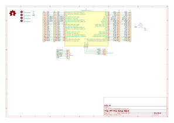

# Raspberry Pi Pico Debug Board

## 概要

Raspberry Pi Pico用のデバッグ用ボード。

ブレッドボードを使うほどでもないが、デバッガはつなぎたい もしくはPicoprobeのデバッグ・ユニットとして使いたい場合に便利なように配線を引き出すためのボードです。

[回路図(PDF)](./RPiPico_SimpleBoard.pdf)

## 特徴

* リセット・スイッチ
* Picoprobe用SWD + UART TX/RXコネクタ
* デバッガ接続用ポゴピン実装スルーホール
* 全信号2列引き出し
  * 信号引き出しつつ、ロジックアナライザを接続可能

## ライセンス

### 基板本体
CC BY 4.0
 This work is licensed under a <a rel="license" href="http://creativecommons.org/licenses/by/4.0/">Creative Commons Attribution 4.0 International License</a>.

### ライブラリ (local.kicad_sym, local.pretty以下)

一部のコンポーネントがKiCad標準のコンポーネントを改変したものであるため、そのライセンス (CC BY-SA 4.0) が適用される

また、Raspberry Pi Picoの3Dモデルも、CC BY-SA 4.0に基いて配布されているので同様である。
https://www.raspberrypi.com/documentation/microcontrollers/raspberry-pi-pico.html

CC BY-SA 4.0
 This work is licensed under a <a rel="license" href="http://creativecommons.org/licenses/by-sa/4.0/">Creative Commons Attribution-ShareAlike 4.0 International License</a>.